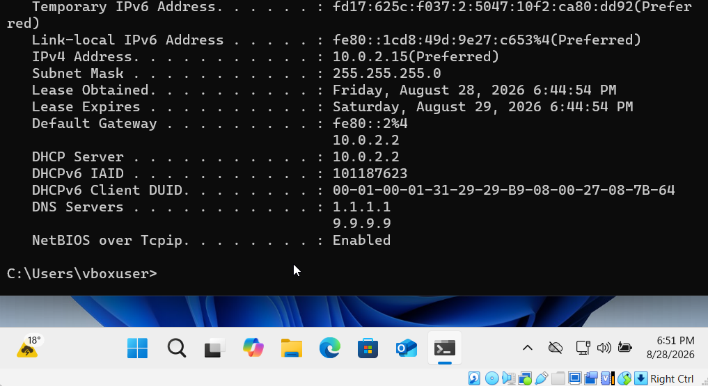
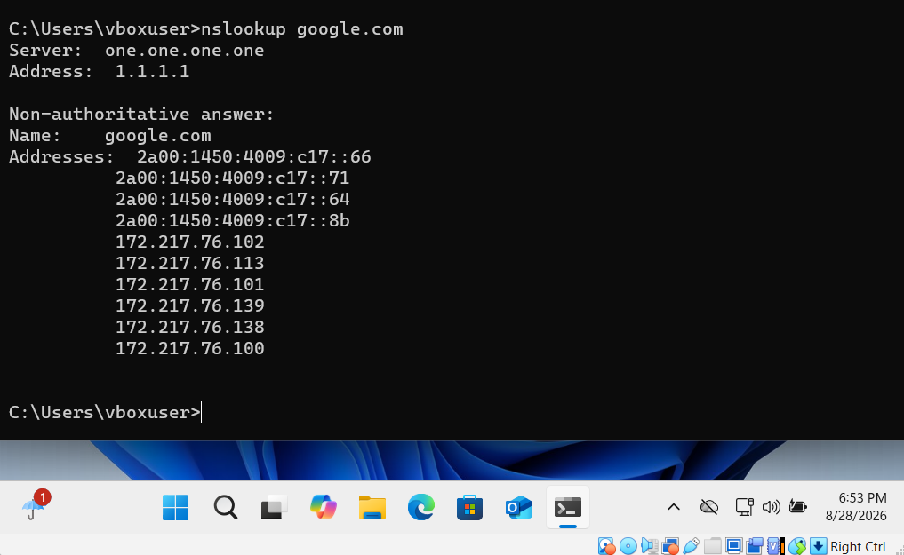
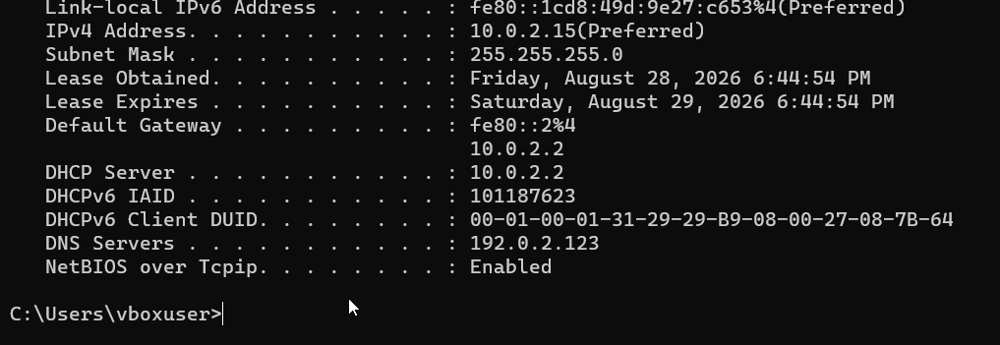
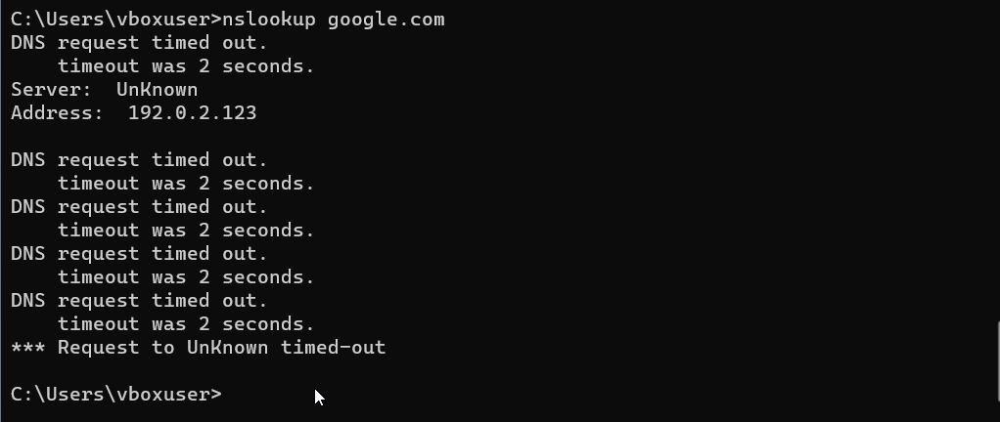

# Incident 01 - DNS Resolution Failure

## Scenario
A Windows 11 user reports that the device appears connected to the network, but websites and other services that rely on domain names are not working.

## Baseline Checks
Before introducing the fault, I confirmed that the Windows 11 virtual machine had normal network connectivity and working DNS resolution.

- `ipconfig /all` showed the device had a valid IPv4 address, default gateway and DNS servers.
- `ping 8.8.8.8` confirmed external IP connectivity.
`nslookup google.com` successfully resolved the domain using DNS server `1.1.1.1`, confirming that DNS resolution was functioning correctly before the fault was introduced.
 
 The baseline configuration showed a valid IPv4 address, default gateway, DHCP configuration and working DNS servers (`1.1.1.1` and `9.9.9.9`).
 
 `nslookup google.com` successfully resolved the domain using DNS server `1.1.1.1`, confirming that DNS resolution was functioning correctly before the fault was introduced.

## Fault Introduction
To simulate a realistic DNS-related support issue, I manually changed the Windows 11 DNS configuration from automatic DHCP settings to an invalid DNS server address:

`192.0.2.123`

This caused hostname resolution to fail while basic IP connectivity remained available.

`ipconfig /all` confirmed that the system was now using `192.0.2.123` as its DNS server.

## Troubleshooting
I first tested connectivity to a known public IP address using:

`ping 8.8.8.8`

The test succeeded with 0% packet loss, confirming that the device still had working IP connectivity despite the reported internet problem.

Because direct IP connectivity worked, I ruled out a complete network connection failure and focused on DNS resolution.
`nslookup google.com` was then used to test DNS resolution directly.

The request timed out while attempting to contact the configured DNS server `192.0.2.123`.

## Root Cause
The device had valid IP connectivity, but the configured DNS server was unreachable. This prevented domain names such as `google.com` from being translated into IP addresses.

The issue was therefore isolated to DNS configuration rather than the network connection itself.

## Resolution
I changed the DNS server assignment from the manually configured invalid address back to `Automatic (DHCP)`.

Windows then received a working DNS configuration again.

## Verification
I ran:

`nslookup google.com`

The lookup succeeded using DNS server `1.1.1.1`, confirming that DNS resolution had been restored.

The incident was resolved successfully. The device had working IP connectivity throughout, and restoring a valid DNS configuration returned normal hostname resolution.

## Skills Demonstrated

- Windows 11 network troubleshooting
- DNS troubleshooting and configuration
- TCP/IP connectivity testing
- Use of `ipconfig`, `ping` and `nslookup`
- Fault isolation and root-cause analysis
- Technical incident documentation
- Resolution verification
