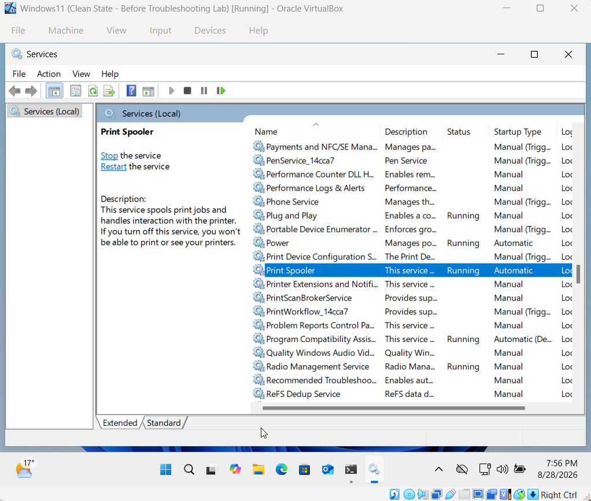
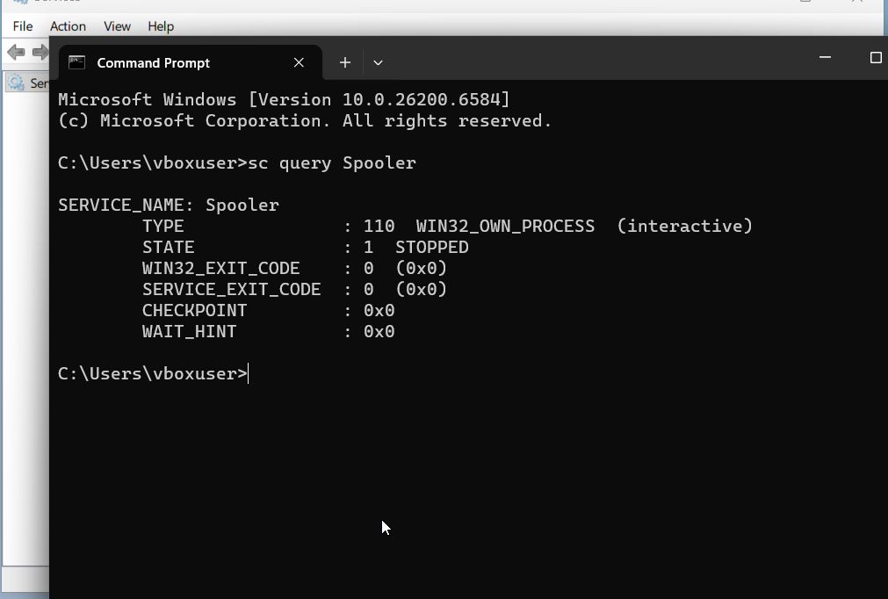
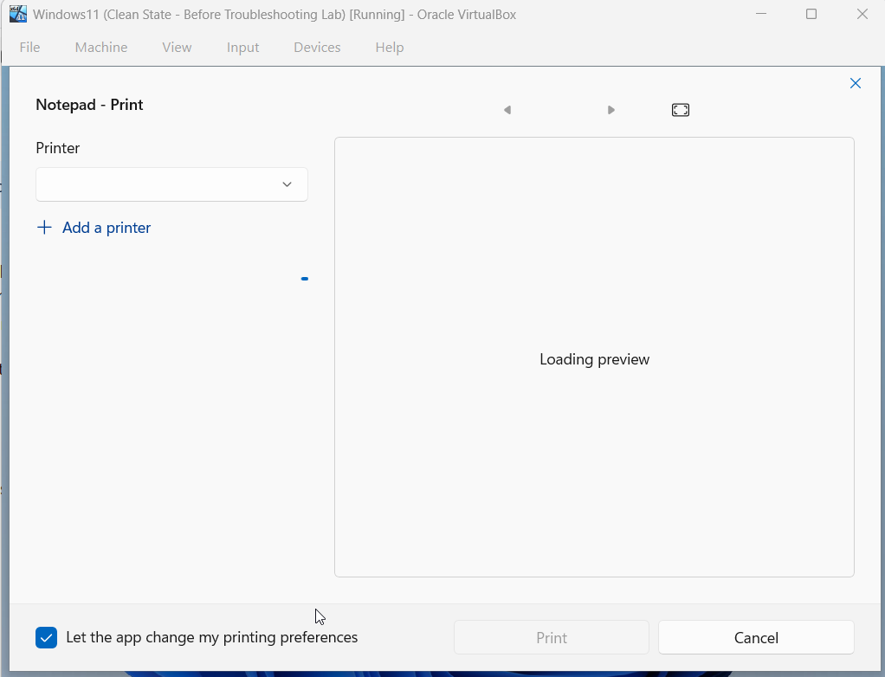
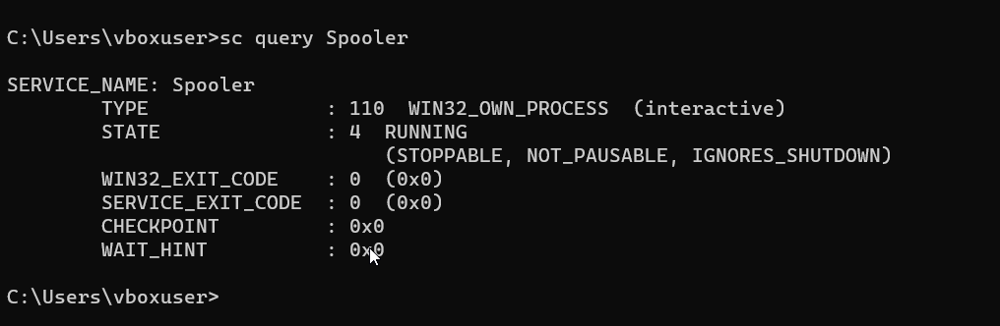
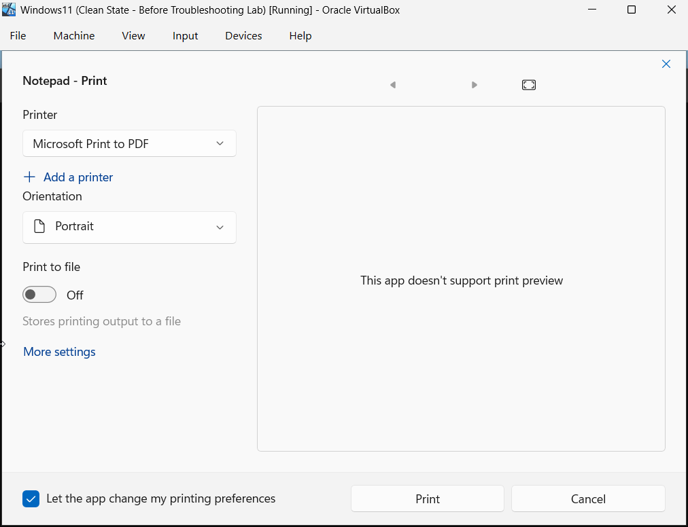

# Incident 02 - Print Spooler Service Failure

## Scenario

A Windows 11 user reports that printers are not appearing when attempting to print from an application.

The objective was to diagnose whether the issue was caused by the Windows Print Spooler service and restore normal printing functionality.

## Baseline Check

Before introducing the fault, I confirmed that the Windows Print Spooler service was operating normally.

- Service: `Print Spooler`
- Status: `Running`
- Startup Type: `Automatic`

This confirmed that the Print Spooler service was active and configured to start automatically before the fault was introduced.

## Fault Introduction

To reproduce the issue, I stopped the Windows Print Spooler service while leaving its Startup Type set to `Automatic`.

I then verified the service state using:

`sc query Spooler`

The command output showed `STATE: 1 STOPPED`, confirming that the Print Spooler service was no longer running.

## User-Facing Symptom

With the Print Spooler service stopped, I opened Notepad and attempted to print using `Ctrl + P`.

The Print window did not display the normal list of available printers and instead remained searching for a printer.

This demonstrated that the stopped Print Spooler service directly affected the user's ability to access available printers.

## Diagnosis and Root Cause

The Print Spooler service was confirmed to be stopped using `sc query Spooler`.

Because the Print Spooler manages print jobs and printer communication in Windows, the stopped service prevented applications from displaying the normal list of available printers.

The root cause was therefore identified as the inactive Print Spooler service.

The command output showed `STATE: 4 RUNNING`, confirming that the Print Spooler service had been restored successfully.

## Verification

After restarting the Print Spooler service, I returned to Notepad and opened the Print window again.

The available printers were displayed normally, confirming that printing functionality had been restored.

The incident was resolved successfully by identifying the stopped Print Spooler service, restoring it, and verifying the result from the user's perspective.

## Skills Demonstrated

- Windows 11 troubleshooting
- Windows Services management
- Print Spooler troubleshooting
- Use of `sc query`
- Fault isolation and root-cause analysis
- User-facing issue verification
- Technical incident documentation
- Resolution verification
