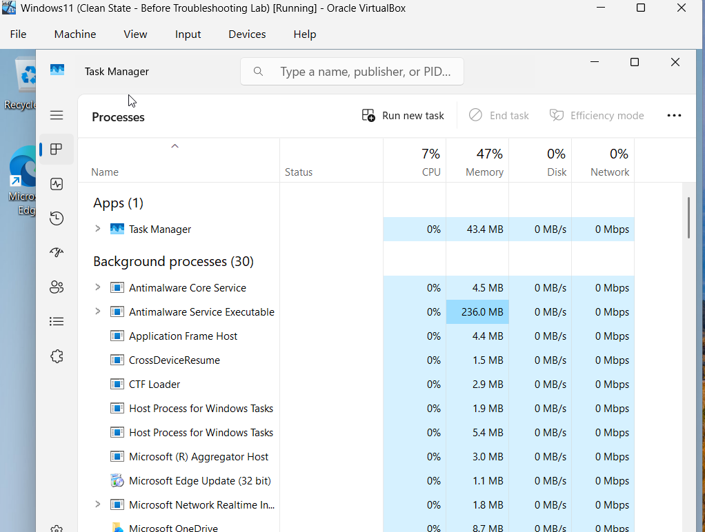
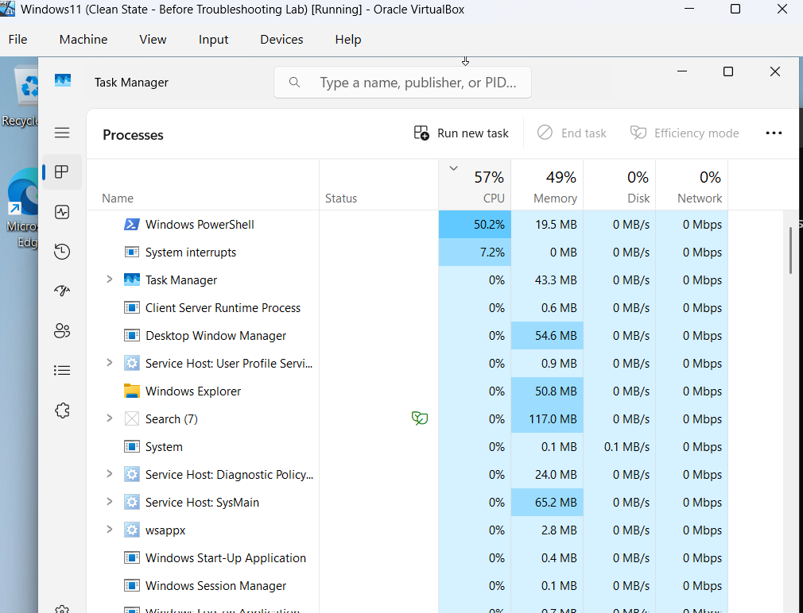
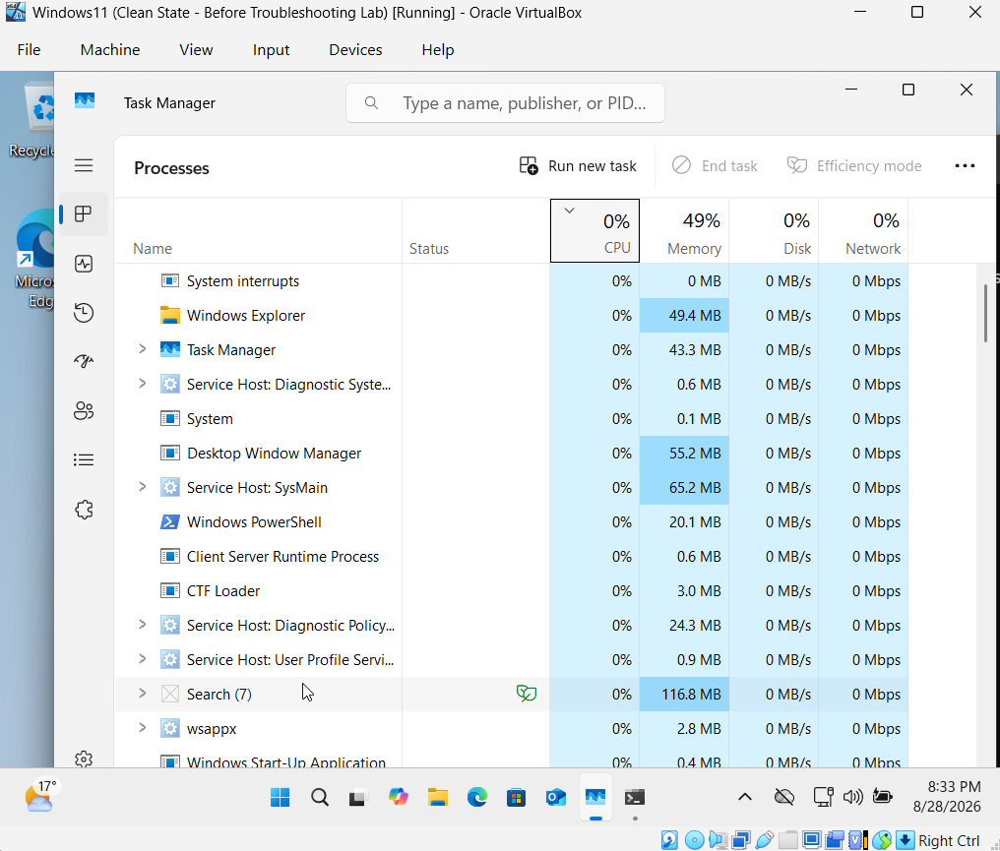

# Incident 03 - Windows System Performance Issue

## Scenario

A Windows 11 user reports that the computer has become unusually slow.

The objective was to identify whether a specific process was consuming excessive system resources, isolate the cause, and restore normal performance.

## Baseline Performance

Before introducing the performance issue, I monitored the Windows 11 virtual machine while it was idle.

Task Manager showed approximately:

- CPU: `7%`
- Memory: `47%`
- Disk: `0%`

This confirmed that the system was operating normally before the fault was introduced.

## Fault Introduction

To reproduce a high-CPU performance issue, I opened PowerShell and ran a continuous loop:

`while ($true) {}`

This caused the PowerShell process to consume a large amount of CPU resources and simulated the type of system slowdown a user might report.

Task Manager showed PowerShell using approximately 50% CPU, significantly higher than the normal baseline.

## Diagnosis and Root Cause

I sorted the processes in Task Manager by CPU usage to identify which process was consuming the most system resources.

PowerShell was using approximately 50% CPU, while the rest of the system remained comparatively low.

This identified the PowerShell process as the cause of the elevated CPU usage and the resulting performance issue.

## Resolution

I returned to the PowerShell window and stopped the continuous loop using:

`Ctrl + C`

This terminated the high-CPU workload without closing or restarting the Windows 11 virtual machine.

## Verification

After stopping the PowerShell loop, I returned to Task Manager and monitored system performance again.

CPU usage dropped back towards the original baseline, confirming that the high-CPU process had been successfully stopped and normal system performance had been restored.

The incident was resolved by identifying the process responsible for excessive CPU usage, stopping the workload, and confirming that system resource usage returned to normal.

## Skills Demonstrated

- Windows 11 performance troubleshooting
- Task Manager process analysis
- CPU utilisation monitoring
- PowerShell process troubleshooting
- Fault isolation and root-cause analysis
- Safe process termination
- Performance verification
- Technical incident documentation
