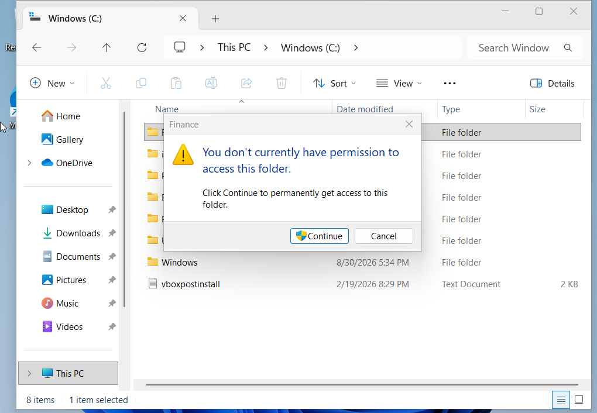
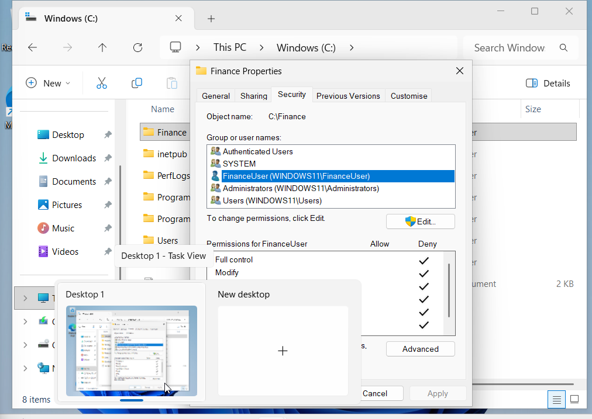
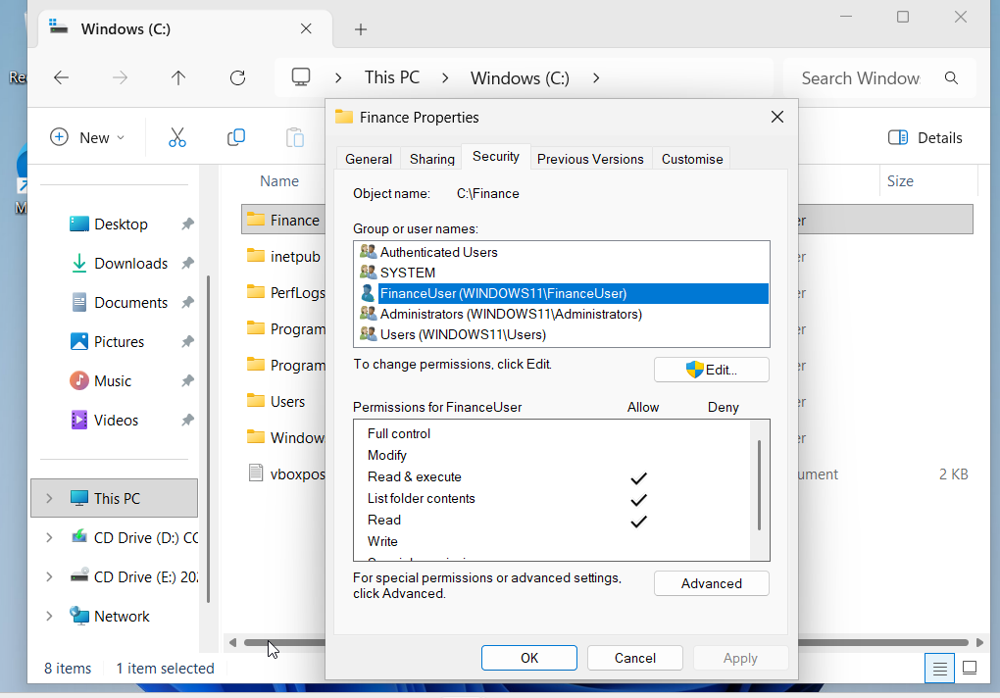
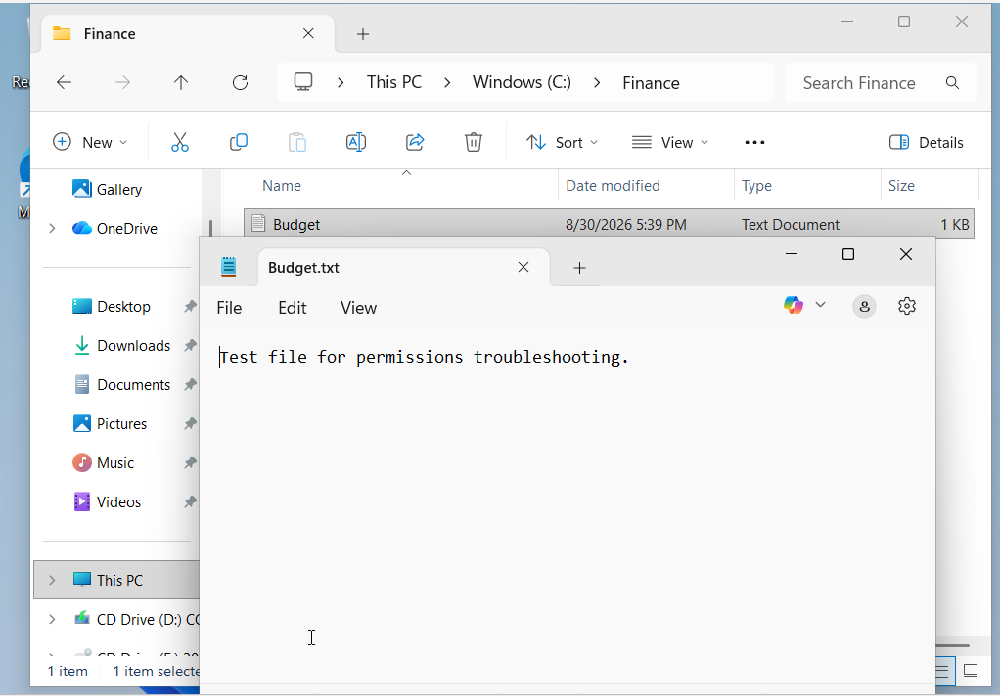

# Incident 04 - File Permissions Access Issue

## Scenario

A Windows 11 user reports that they cannot access a shared work folder and receive a permissions error when attempting to open it.

The objective was to identify the cause of the access problem, correct the permissions, and verify that the affected user could access the folder and file successfully.

## User-Facing Symptom

When signed in as `FinanceUser`, I attempted to open:

`C:\Finance`

Windows displayed a message stating that the user did not currently have permission to access the folder.

This confirmed that the issue affected the user’s ability to access the folder rather than the folder being missing or unavailable.

## Diagnosis and Root Cause

I reviewed the folder permissions from an administrator account by opening:

`C:\Finance → Properties → Security`

`FinanceUser` was listed with explicit permissions configured under **Deny**.

Because explicit Deny permissions override Allow permissions in Windows NTFS access control, this explained why the user could not open the folder.

The permissions configuration confirmed that the access problem was caused by an explicit Deny rule applied to `FinanceUser`.

## Resolution

I edited the folder permissions for `FinanceUser` and removed the explicit Deny permissions.

I then granted the permissions required for normal access:

- Read & execute
- List folder contents
- Read

The corrected permissions allowed `FinanceUser` to access the folder without granting unnecessary write or modification rights.

## Verification

I signed back in as `FinanceUser` and attempted to access:

`C:\Finance`

The folder opened successfully, and `Budget.txt` could be opened normally.

This confirmed that the permissions issue had been resolved and that the affected user could access the required folder and file.

## Skills Demonstrated

- Windows 11 file permissions troubleshooting
- NTFS permissions and access control
- User account troubleshooting
- Identification of explicit Deny permissions
- Principle of least privilege
- Fault isolation and root-cause analysis
- Access verification from the affected user account
- Technical incident documentation
