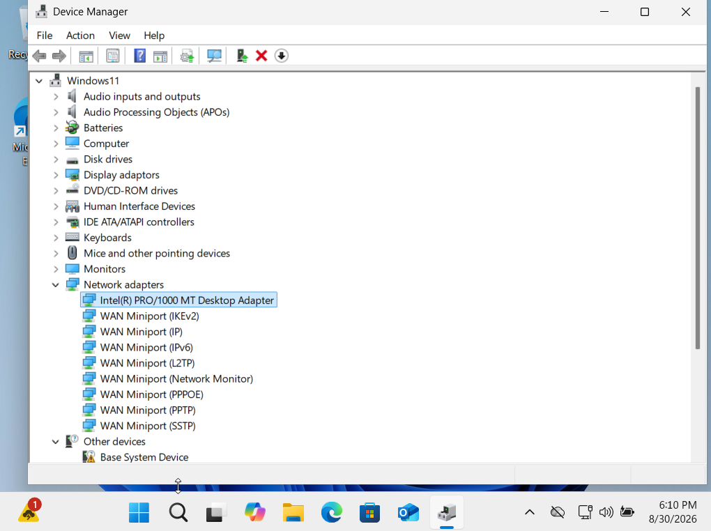
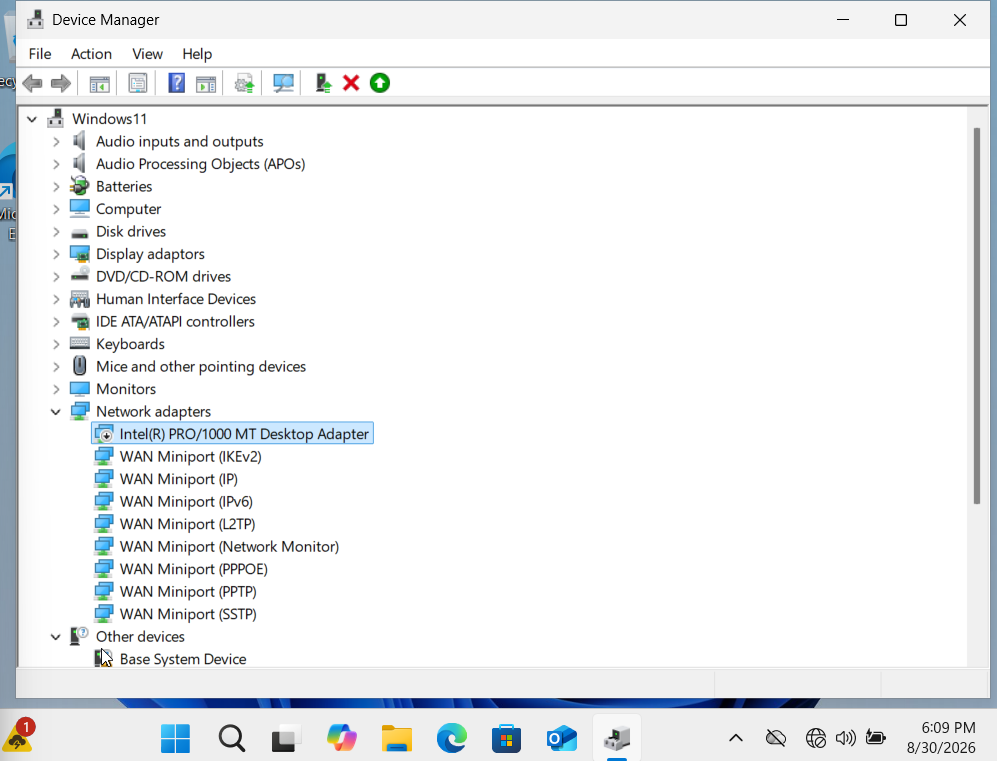
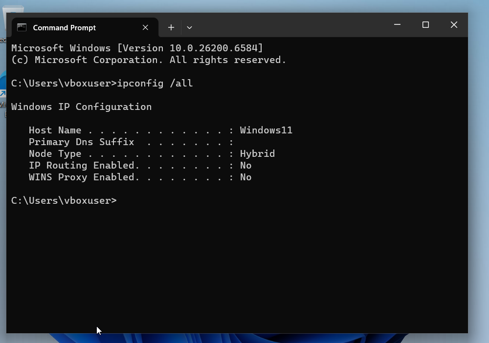
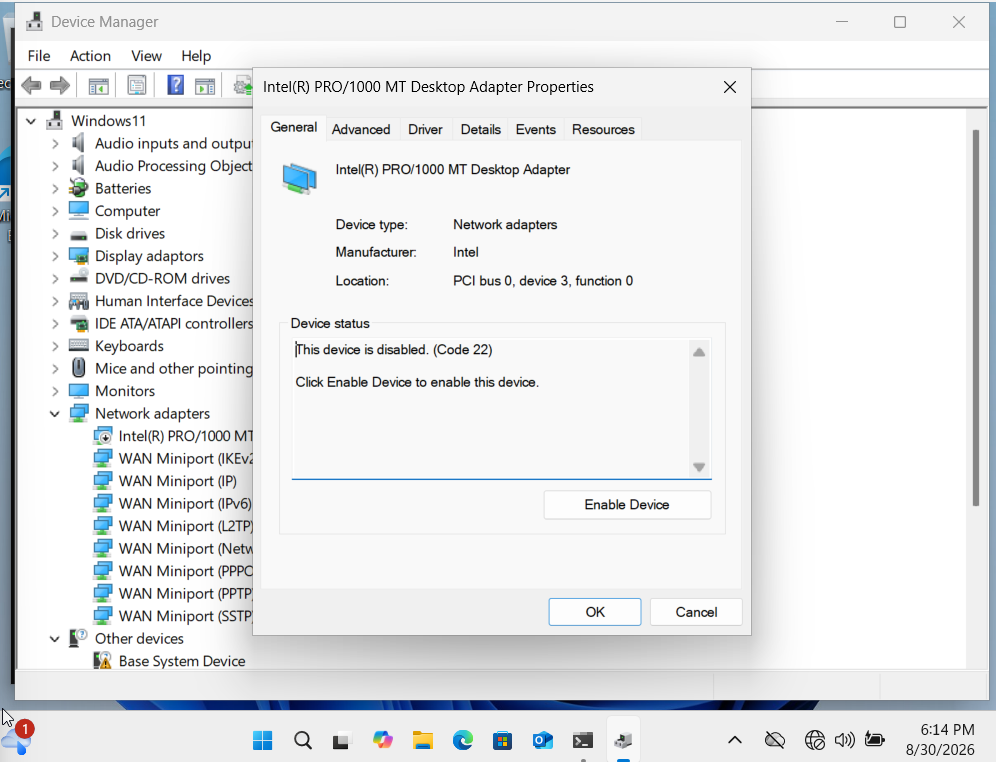
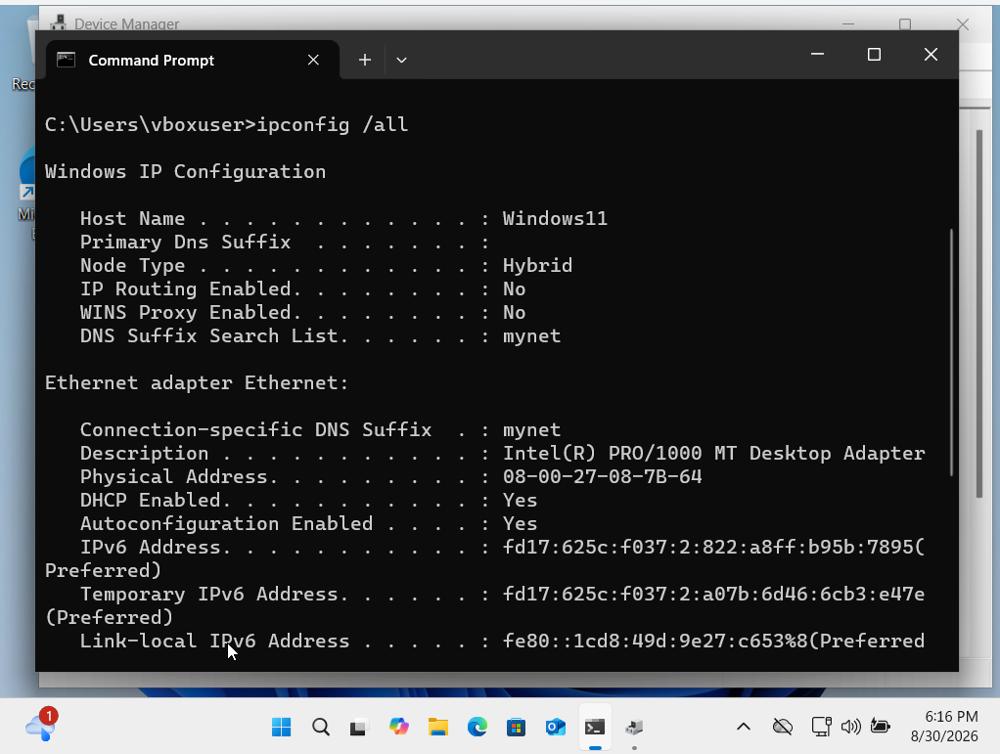
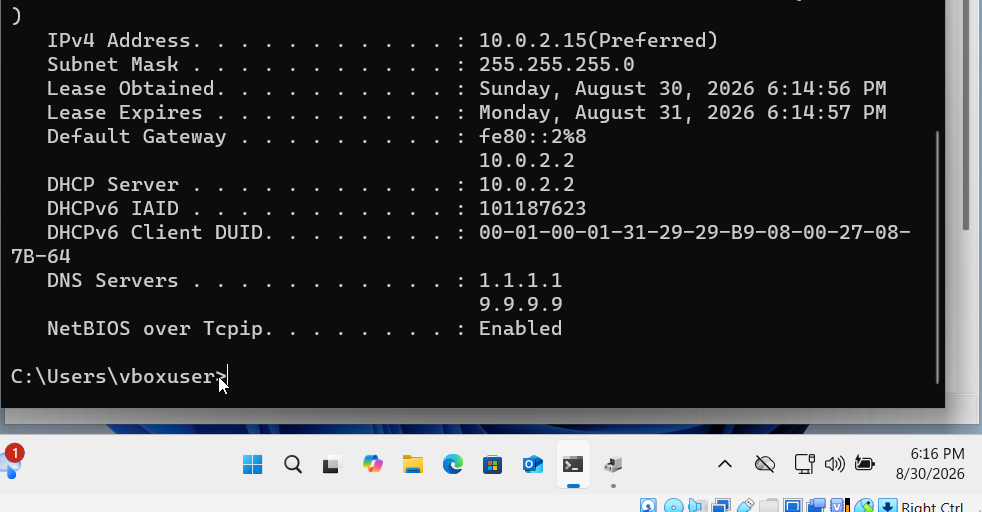

# Incident 05 - Network Adapter Connectivity Issue

## Scenario

A Windows 11 user reports that the computer has suddenly lost network connectivity and shows no internet connection.

The objective was to identify whether the issue was caused by the Windows network adapter, restore connectivity, and verify that the system received a valid network configuration again.

## Baseline Check

Before introducing the fault, I confirmed that the Windows 11 network adapter was enabled and operating normally.

The active adapter was:

`Intel(R) PRO/1000 MT Desktop Adapter`

Device Manager showed the network adapter enabled with no disabled-device indicator, confirming that the adapter was functioning normally before the fault was introduced.

## Fault Introduction and User-Facing Symptom

To reproduce the connectivity issue, I disabled the active network adapter in Device Manager.

Windows immediately reported that there was no internet connection.

The disabled-device indicator appeared on the Intel network adapter, while the Windows network status showed that connectivity had been lost.

## Diagnosis

I opened Command Prompt and ran:

`ipconfig /all`

With the network adapter disabled, Windows no longer displayed an active Ethernet adapter configuration.

The absence of Ethernet adapter details indicated that Windows did not currently have an active network interface available for IP communication.

## Root Cause

I opened the properties of the `Intel(R) PRO/1000 MT Desktop Adapter` in Device Manager.

Windows reported:

`This device is disabled. (Code 22)`

This confirmed that the loss of network connectivity was caused by the network adapter being disabled at the device level.

The Code 22 status provided a clear device-level explanation for why Windows no longer showed an active Ethernet configuration.

## Resolution

I re-enabled the `Intel(R) PRO/1000 MT Desktop Adapter` in Device Manager.

Windows immediately restored network connectivity.

## Verification

I ran:

`ipconfig /all`

The Ethernet adapter appeared again with a valid network configuration, including an IPv4 address, default gateway, DHCP server and DNS servers.

The restored configuration confirmed that the network adapter was active again and that normal IP connectivity had been re-established.

## Skills Demonstrated

- Windows 11 network troubleshooting
- Device Manager diagnostics
- Network adapter troubleshooting
- Interpretation of Device Manager error codes
- Use of `ipconfig /all`
- Fault isolation and root-cause analysis
- Network connectivity restoration
- Technical incident documentation
- Resolution verification
